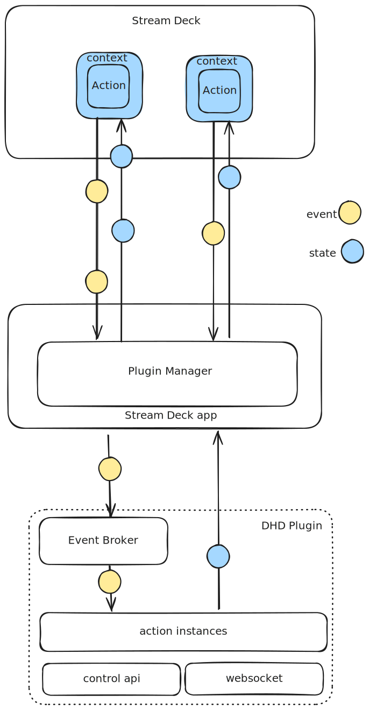

# DHD Stream Deck Plugin

A Stream Deck Plugin to control Devices by DHD audio. It uses DHD's control API via WebSocket.

It also serves as a code sample for developers interested in implementing DHD's control API. 
**Control API requires DHD XC3/XD3/X3 IP Cores with a minimum firmware version 10.3**.

## Supported Actions

Supported actions are all boolean values that are `true` or `false`. For example:

- Channel On/Off
- PFL On/Off
- Set logic function values
- and more.

## Get started

- Install the plugin.
- Configure any action and click the 'Configure DHD Connection'.
- Enter the DHD Device hostname or IP address as well as the Token created in system app and click save. The values are globally stored for each action.
- Back at the action, enter the exact path of the value according to the control api syntax, e.g. `/audio/mixers/0/faders/0/on`. See [DHD developer portal](https://developer.dhd.audio/) for more information.
- If the action detects a `pfl1` path, the icon will be exchanged by a `PFL` icon.

## How it works

The DHD plugin operates as a single instance, meaning that all actions on the Stream Deck send events to this one instance of the DHD plugin.



When the DHD plugin is created (the `onAppear` event is emitted), an action instance is created for each action context. This ensures that every action has its own unique instance linked to the plugin.

The Event Broker subscribes to events like `keyUp` or `didReceiveSettings`, allowing it to manage and handle incoming events related to specific actions.

When a `keyUp` event is emitted, the event's context ID is used to identify the corresponding action instance. The `onKeyUp` function of that action instance is then called.

The `onKeyUp` function communicates with the DHD Device via the control API. A `set` message is sent to the DHD Device, for example:

```json
{
  "msgID": 1,
  "method": "set",
  "path": "/audio/mixers/0/automix/1/attmax",
  "payload": 14
}
```

The control API sends back a response, which is handled by the `websocket.onmessage` function, ensuring the correct processing of the API's feedback.

When an action instance is created, the `onWillAppear` function is called. This function subscribes the action instance to a specific control API `path`. The `path` is included in the response message of the `set` message, for example:

```json
{
  "msgID": 1,
  "method": "set",
  "path": "/audio/mixers/0/automix/1/attmax",
  "payload": 14,
  "success": true
}
```

This allows the action instance to be properly linked to the API and receive updates.

## DHD Control API

Control API documentation is available at the [DHD developer portal](https://developer.dhd.audio/).

## Contributing

Follow the documentation of the [Stream Deck SDK](https://docs.elgato.com/sdk/) to get started developing the plugin. Then clone the repository to your machine and install the required streamdeck library submodule using `git submodule update --init --recursive`.

If you have added new features or fixed bugs, feel free to create a pull request.

